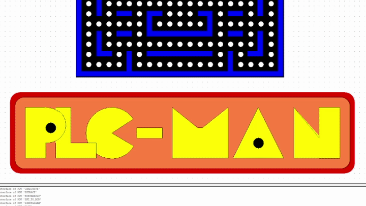

# Pacman PLC (CoDeSys v2.3)

*[EN] English below · [PL] Polska wersja niżej*

## [EN] Overview

A Pacman game running on a soft-PLC in CoDeSys v2.3. The game logic combines two IEC 61131-3 languages: Ladder Diagram (LD) for the main program and input handling, and Structured Text (ST) for the maze and collision logic. Graphics use the built-in CoDeSys visualization.

## Architecture

| POU | Type | Language | Role |
| --- | --- | --- | --- |
| `PLC_PRG` | Program | LD | Main program: input latching, movement timing, position counters, animation |
| `MAPA` | Function block | ST | One-time maze initialization (walls and collectible dots) |
| `OBLICZ_KOLIZJE` | Program | ST | Checks the neighboring cells and sets the "free direction" flags |

- **Maze as 2D arrays.** The board is a 21 × 16 grid stored in two global arrays: `MAPA : ARRAY[0..20, 0..15] OF BOOL` (walls) and `Mapa_Punkty : ARRAY[0..20, 0..15] OF BOOL` (dots).
- **Collision detection.** Every PLC cycle, `OBLICZ_KOLIZJE` checks the cells next to the player's position (`hoz`, `ver`), with bounds checking, and sets `Wolne_Prawo / Wolne_Lewo / Wolne_Gora / Wolne_Dol`. Movement into a wall is blocked.
- **Movement and timing.** The player coordinates are driven by up/down counters (`CTUD`), stepped by a 200 ms `TON` timer.
- **Input handling.** W, A, S, D are mapped to inputs `S1`–`S4` and latched with `SR` flip-flops, so the player keeps moving in the last chosen direction.
- **Visualization.** The `GRA` screen binds sprite positions directly to the PLC coordinate variables. A separate timer drives the mouth animation.

## Repository structure

- `POUs/` — exported program blocks (`PLC_PRG`, `MAPA`, `OBLICZ_KOLIZJE`)
- `Global_Variables/` — global variables: maze arrays, coordinates, movement flags
- `Visualizations/` — HMI screen `GRA` and its variable bindings
- `PACMAN.pro` — complete CoDeSys v2.3 project file
- `.pacman_demo.gif`, `.game_preview.png` — demo animation and screenshot

## How to run

1. Open `PACMAN.pro` in CoDeSys v2.3.
2. Enable simulation: **Online → Simulation Mode**.
3. Log in (**Online → Login**, `Alt+F8`) and start the program (**Online → Run**, `F5`).
4. Open the `GRA` visualization and control the player with W, A, S, D.

---

## [PL] Opis

Gra Pacman uruchamiana na wirtualnym sterowniku PLC w CoDeSys v2.3. Logika gry łączy dwa języki normy IEC 61131-3: drabinkę (LD) w programie głównym i obsłudze wejść oraz Structured Text (ST) w logice mapy i kolizji. Grafika korzysta z wbudowanej wizualizacji CoDeSys.

## Architektura

| POU | Typ | Język | Rola |
| --- | --- | --- | --- |
| `PLC_PRG` | Program | LD | Program główny: zatrzaskiwanie wejść, taktowanie ruchu, liczniki pozycji, animacja |
| `MAPA` | Blok funkcyjny | ST | Jednorazowa inicjalizacja labiryntu (ściany i punkty do zebrania) |
| `OBLICZ_KOLIZJE` | Program | ST | Sprawdza sąsiednie pola i ustawia flagi wolnych kierunków |

- **Labirynt na tablicach 2D.** Plansza to siatka 21 × 16 zapisana w dwóch tablicach globalnych: `MAPA : ARRAY[0..20, 0..15] OF BOOL` (ściany) i `Mapa_Punkty : ARRAY[0..20, 0..15] OF BOOL` (punkty).
- **Detekcja kolizji.** W każdym cyklu PLC program `OBLICZ_KOLIZJE` sprawdza pola sąsiadujące z pozycją gracza (`hoz`, `ver`), z kontrolą granic tablicy, i ustawia `Wolne_Prawo / Wolne_Lewo / Wolne_Gora / Wolne_Dol`. Ruch w ścianę jest blokowany.
- **Ruch i taktowanie.** Współrzędne gracza są sterowane licznikami rewersyjnymi `CTUD`, taktowanymi timerem `TON` co 200 ms.
- **Obsługa wejść.** Klawisze W, A, S, D są przypisane do wejść `S1`–`S4` i zatrzaskiwane przerzutnikami `SR`, więc postać porusza się dalej w ostatnio wybranym kierunku.
- **Wizualizacja.** Ekran `GRA` wiąże położenie postaci bezpośrednio ze zmiennymi współrzędnych w PLC. Osobny timer steruje animacją otwierania ust.

## Struktura repozytorium

- `POUs/` — wyeksportowane bloki programowe (`PLC_PRG`, `MAPA`, `OBLICZ_KOLIZJE`)
- `Global_Variables/` — zmienne globalne: tablice labiryntu, współrzędne, flagi ruchu
- `Visualizations/` — ekran HMI `GRA` i powiązania zmiennych
- `PACMAN.pro` — kompletny projekt CoDeSys v2.3
- `.pacman_demo.gif`, `.game_preview.png` — animacja demonstracyjna i zrzut ekranu

## Uruchomienie

1. Otwórz `PACMAN.pro` w CoDeSys v2.3.
2. Włącz symulację: **Online → Simulation Mode**.
3. Zaloguj się (**Online → Login**, `Alt+F8`) i uruchom program (**Online → Run**, `F5`).
4. Otwórz wizualizację `GRA` i steruj postacią klawiszami W, A, S, D.
